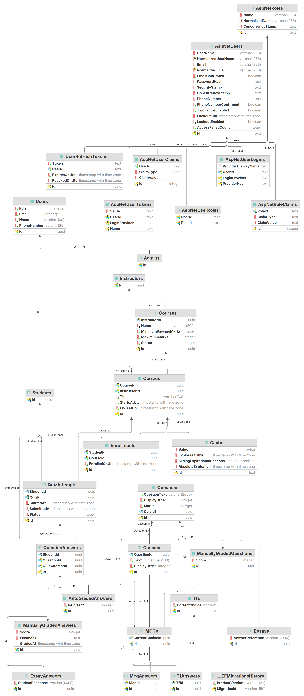
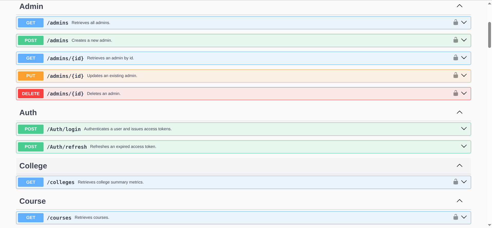
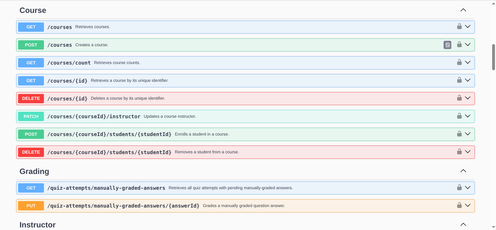
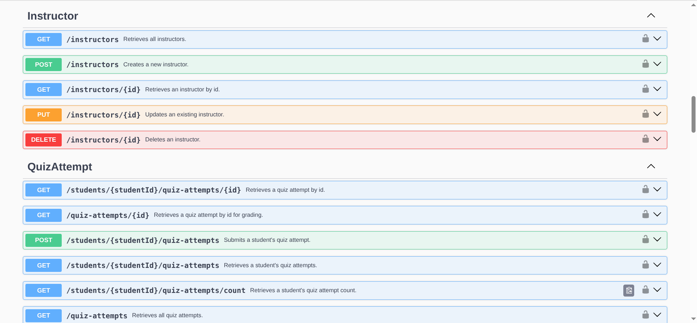
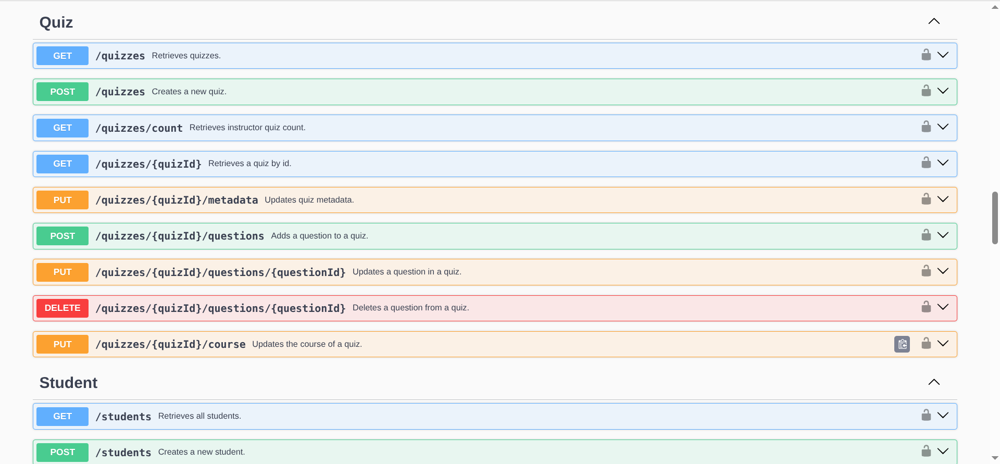
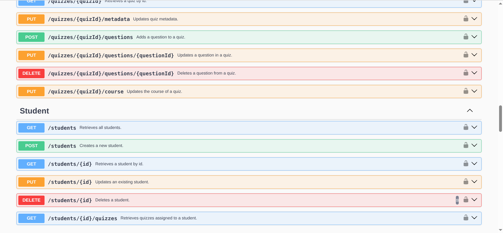
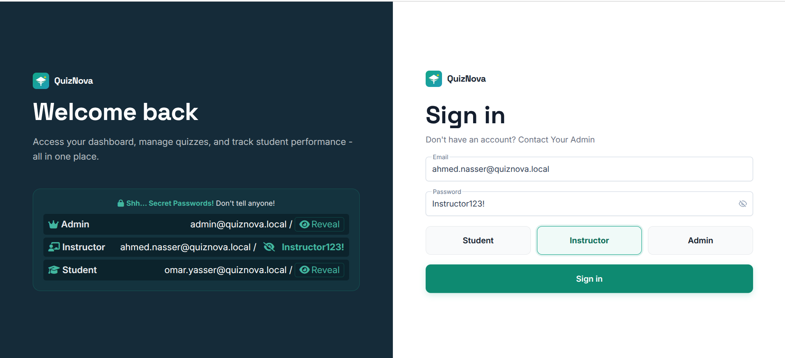
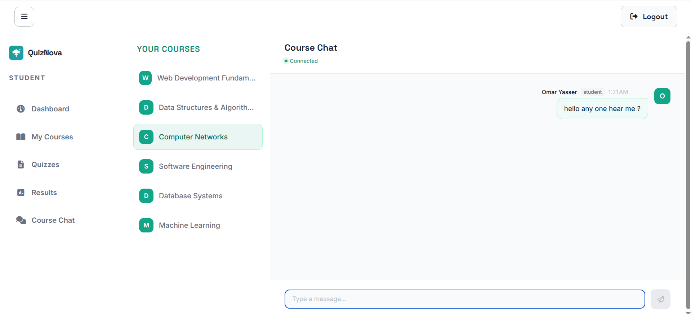
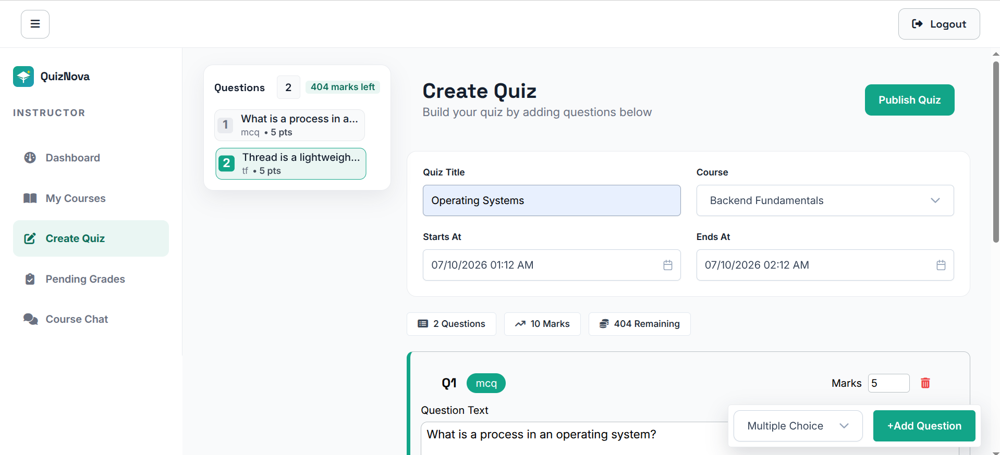
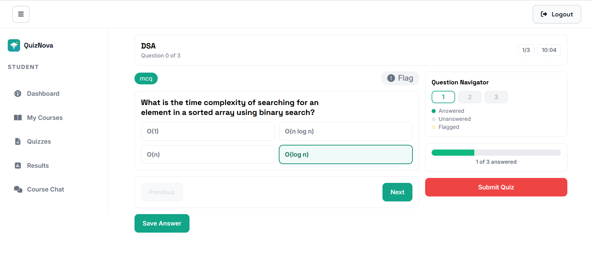

<div align="center">

# 🚀 QuizNova

## [🔗 Live Demo](https://moamenelbarqy.github.io/quiz-nova/)

**Full-Stack Quiz Management System**  
Built with **.NET 10** · **Angular 21** · **PostgreSQL** · **SignalR**

[](https://dotnet.microsoft.com/)
[](https://angular.dev/)
[](https://www.postgresql.org/)
[](LICENSE)
[](https://github.com/MoamenElbarqy/quiz-nova/actions)

</div>

---

## 📑 Table of Contents

- [📸 Screenshots](#-screenshots)
- [🏗️ Architecture Overview](#️-architecture-overview)
- [✨ Key Features](#-key-features)
- [⚙️ Technical Deep Dives](#️-technical-deep-dives)
- [🖥️ Frontend Architecture](#️-frontend-architecture)
- [🛠️ Tech Stack](#️-tech-stack)
- [🧪 Testing Strategy](#-testing-strategy)
- [🚦 Getting Started](#-getting-started)
- [🔄 CI/CD Pipeline](#-cicd-pipeline)

---

## 📸 Screenshots

<details>
<summary>📂 View Database Schema & Swagger UI Screenshots</summary>

### 🗄️ Relational Schema

<div align="center">
  
</div>

### 🔌 REST API — Swagger Endpoints

<table>
  <tr>
    <td width="50%" align="center">
      <b>👑 Admin, Auth & College Endpoints</b><br/>
      
    </td>
    <td width="50%" align="center">
      <b>📚 Course & Grading Endpoints</b><br/>
      
    </td>
  </tr>
  <tr>
    <td width="50%" align="center">
      <b>👨‍🏫 Instructor Attempts Endpoints</b><br/>
      
    </td>
    <td width="50%" align="center">
      <b>🧑‍🎓 Student Quiz Endpoints (Part 1)</b><br/>
      
    </td>
  </tr>
  <tr>
    <td width="50%" align="center">
      <b>🧑‍🎓 Student Quiz Endpoints (Part 2)</b><br/>
      
    </td>
    <td width="50%"></td>
  </tr>
</table>

### 🖥️ Application Pages

<table>
  <tr>
    <td width="50%" align="center">
      <b>🔑 Login Page</b><br/>
      
    </td>
    <td width="50%" align="center">
      <b>💬 Course Chat Room</b><br/>
      
    </td>
  </tr>
  <tr>
    <td width="50%" align="center">
      <b>👨‍🏫 Instructor — Create Quiz</b><br/>
      
    </td>
    <td width="50%" align="center">
      <b>🧑‍🎓 Student — Quiz Attempt</b><br/>
      
    </td>
  </tr>
</table>

</details>

---

## 🏗️ Architecture Overview

QuizNova is designed using **Clean Architecture** principles, enforcing a strict inward dependency flow to keep the domain pure and testable.

```
┌────────────────────────────────────────────────────────┐
│                    Presentation                        │
│          API Controllers  ·  Angular Client            │
├────────────────────────────────────────────────────────┤
│                    Application                         │
│       Commands / Queries (CQRS)  ·  MediatR            │
│   FluentValidation  ·  Pipeline Behaviours             │
├────────────────────────────────────────────────────────┤
│                      Domain                            │
│     Enriched Entities  ·  Value Objects  ·  Results    │
├────────────────────────────────────────────────────────┤
│                   Infrastructure                       │
│   EF Core  ·  PostgreSQL  ·  Outbox  ·  Hybrid Cache    │
│   OpenTelemetry  ·  Serilog  ·  Seq  ·  Loki Logging   │
└────────────────────────────────────────────────────────┘
```

- **CQRS via MediatR**: Pipeline Behaviours intercept requests for cross-cutting concerns (validation, logging, caching).
- **Result Pattern**: Enforces error handling as control flow using a custom `Result<T>` monad and strongly typed `Error` objects instead of throwing exceptions.
- **Rich Domain Model**: Aggregate roots enforce structural invariants at construction.

---

## ✨ Key Features

- **🔐 Role-Based Access Control (RBAC)**: Custom permissions for **Admins** (system-wide auditing & enrollments), **Instructors** (quiz creation, manual essay grading, dashboards), and **Students** (quiz attempts, results, chat).
- **📝 Gradual Quiz Engine**:
  - Supports Multiple Choice (MCQ), True/False, and **Essay** (manually graded) questions.
  - Interactive **gradual attempt flow** (`Start` → `SubmitAnswer` → `Complete`) with a countdown timer to prevent data loss.
  - Extensible grading rules via a generic `CorrectionCondition` predicate.
- **💬 Course Chat Rooms**: Real-time course chat channels powered by **SignalR** supporting instant messaging and emoji reactions, integrated with MediatR CQRS.
- **🚦 Security & Rate Limiting**: Dedicated rate-limiting policies (`Global`, `Auth`, and `SubmitQuiz`) preventing brute-force attacks and request spamming.
- **📊 Observability Stack**: Centralized logging with **Serilog**, distributed tracing via **OpenTelemetry**, log aggregation with **Grafana Loki/Seq**, and metrics scraped by **Prometheus** for **Grafana** visualization.

---

## ⚙️ Technical Deep Dives

<details>
<summary>🧩 Polymorphic Question & Answer System (Liskov Substitution Principle)</summary>

Models questions and answers through a two-level polymorphic hierarchy mapping EF Core discriminators to separate types:

```text
                  ┌──────────────────┐
                  │    Question      │  ← abstract base
                  └────────┬─────────┘
            ┌──────────────┴──────────────┐
  ┌─────────┴────────────┐     ┌──────────┴───────────┐
  │  AutoGradedQuestion  │     │ManuallyGradedQuestion│
  │  <TAnswer>           │     │• Score (nullable)    │
  └────────┬─────────────┘     └──────────┬───────────┘
     ┌─────┴─────┐                        │
  ┌──┴──┐     ┌──┴──┐               ┌─────┴─────┐
  │ MCQ │     │ T/F │               │   Essay   │
  └─────┘     └─────┘               └───────────┘
```

- **Open-Closed Principle (OCP)**: Each auto-graded type defines its own `CorrectionCondition` predicate mapping (`studentChoice => studentChoice == CorrectChoice`). The grading engine solver simply evaluates this predicate without knowing the concrete class.
- **LSP in Practice**: The quiz attempt handler dispatches solver logic through the base `Question` type:

  ```csharp
  Result<QuestionAnswer> createAnswerResult = (question, request.Answer) switch
  {
      (Mcq mcqQuestion, SubmitMcqAnswerCommand mcqAnswer) =>
          mcqQuestion.Solve(mcqAnswer.SelectedChoiceId, studentId, attempt.Id),
      (Tf tfQuestion, SubmitTfAnswerCommand tfAnswer) =>
          tfQuestion.Solve(tfAnswer.StudentChoice, studentId, attempt.Id),
      (Essay essayQuestion, SubmitEssayAnswerCommand essayAnswer) =>
          essayQuestion.Solve(essayAnswer.StudentResponse, studentId, attempt.Id),
      _ => Error.Unexpected("QuizAttempt.Answer.AnswerTypeMismatch", "...")
  };
  ```

</details>

<details>
<summary>⚡ Caching Pipeline & Inline Invalidation</summary>

QuizNova uses a **Hybrid Cache** (L1 in-process + L2 PostgreSQL distributed cache via `Community.Microsoft.Extensions.Caching.PostgreSql`), bypassing the need for Redis in lightweight setups.

- **Cache-Aside Pattern**: Handlers implement `ICachedQuery` to automatically cache response payloads through a MediatR caching pipeline behavior.
- **Inline Invalidation**: Invalidation runs inline in commands immediately after `SaveChangesAsync()` to eliminate stale cache windows entirely:

  ```csharp
  await dbContext.SaveChangesAsync(ct);
  await cacheInvalidator.InvalidateAsync(["quizzes"], ct);
  ```

</details>

<details>
<summary>📨 Transactional Outbox with LISTEN/NOTIFY Trigger</summary>

Ensures reliable event dispatching without dual-write inconsistency:

- **Atomicity**: Outbox messages are saved within the same database transaction as business entities.
- **LISTEN/NOTIFY Push Mechanism**: A PostgreSQL trigger alerts the background service on record inserts via `pg_notify('outbox_channel', Id)`, reducing database CPU polling overhead:

  ```sql
  CREATE OR REPLACE FUNCTION notify_outbox_insert()
  RETURNS trigger AS $$
  BEGIN
      PERFORM pg_notify('outbox_channel', NEW."Id"::text);
      RETURN NEW;
  END;
  $$ LANGUAGE plpgsql;
  ```

- **Process Safety**: Employs `FOR UPDATE SKIP LOCKED` for concurrent safety across multiple app replicas.
- **Resilience**: Features a 30-second fallback polling interval if notification channels drop.

</details>

<details>
<summary>🧼 DDD Cleanups & Design Patterns</summary>

- **Value Objects**: Primitive values are wrapped into value objects (e.g., `PersonalInformation` grouping `Name`, `Email`, `PhoneNumber`) with encapsulated validation, avoiding primitive obsession.
- **Signal Store State Management**: Uses fine-grained **NgRx Signal Stores** with custom extensions like `withRequestStatus()` to encapsulate HTTP states (`idle → pending → fulfilled | error`).
- **Deferred Layout Rendering**: Speeds up initial dashboard loading by wrapping heavy performance and enrollment charts in Angular `@defer (on viewport)` tags.

</details>

---

## 🖥️ Frontend Architecture

- **NgRx Signal Store**: Reactive state management built on top of Angular Signals.
- **Atomic Layout**: UI components are mapped dynamically using `NgComponentOutlet` for rendering polymorphic questions, maintaining a clean open-closed component model.
- **Route Guards & Interceptors**:
  - `role.guard.ts`: Role-based route protection and redirects.
  - `auth.interceptor.ts`: Attaches Bearer JWT headers and manages silent token renewals using a `RefreshToken` exchange flow.

---

## 🛠️ Tech Stack

| Layer | Technologies |
|---|---|
| **Backend** | .NET 10, EF Core 10, ASP.NET Core Identity, MediatR, FluentValidation, SignalR |
| **Frontend** | Angular 21 (Signals), NgRx Signal Store, PrimeNG 21, Vanilla CSS (Stylelint CSS property order) |
| **Databases & Cache** | PostgreSQL 18.3, Hybrid Cache (PostgreSQL L2 backend) |
| **Observability** | OpenTelemetry, Serilog, Seq, Prometheus, Grafana, Grafana Loki |
| **Containerization** | Docker, Docker Compose |

---

## 🧪 Testing Strategy

QuizNova implements a four-layer test pyramid:

- **Domain Unit Tests** (`QuizNova.Domain.UnitTests`): Business invariants, grading rules, attempt lifecycle.
- **Application Unit Tests** (`QuizNova.Application.UnitTests`): Pipeline behaviors, mappings, validators.
- **Subcutaneous Tests** (`QuizNova.Application.SubcutaneousTests`): MediatR handler pipelines with a real database.
- **Integration Tests** (`QuizNova.Api.IntegrationTests`): Controller endpoint verification using **Testcontainers**.
- **End-to-End Tests**: Playwright browser tests structured with the Page Object Model (POM) running in CI.

---

## 🚦 Getting Started

### ⚡ Quick Start (Docker)

```bash
git clone https://github.com/MoamenElbarqy/quiz-nova.git
cd quiz-nova
docker compose up -d
```

| Service | URL |
|---|---|
| 🌐 Web App | [`http://localhost:4200`](http://localhost:4200) |
| 📘 Swagger API | [`http://localhost:8080/swagger`](http://localhost:8080/swagger) |
| 📙 Scalar API | [`http://localhost:8080/scalar`](http://localhost:8080/scalar) |
| 📋 Seq Logs | [`http://localhost:5341`](http://localhost:5341) |
| 📈 Grafana | [`http://localhost:3000`](http://localhost:3000) |

### 🔐 Demo Credentials

Ready to explore? The application comes pre-seeded with demo accounts. Use any of the credentials below on the login page:

| Role | Email | Password |
|---|---|---|
| 👑 Admin | `admin@quiznova.local` | `Admin123!` |
| 👨‍🏫 Instructor | `ahmed.nasser@quiznova.local` | `Instructor123!` |
| 🧑‍🎓 Student | `omar.yasser@quiznova.local` | `Student123!` |

> 💡 The demo credentials are also displayed on the login page for quick reference.

---

## 🔄 CI/CD Pipeline

The project features a split-path GitHub Actions workflow:

- **CI (`ci.yml`)**: Builds and runs backend tests and frontend building/linting in parallel on every push or pull request. StyleCop and ESLint rules are treated as build errors.
- **Deploy**: Deploys the frontend to GitHub Pages and packages the backend API into a Docker image published to GitHub Container Registry (GHCR).
